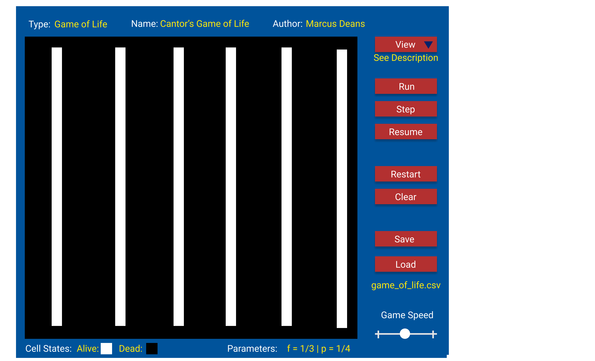

# Cell Society Design Plan

### Team Number 15

### Names

* Morgan Feist
* Marcus Deans
* Drew Peterson

## Design Overview
> Design Overview. Describe the classes you intend to create, without revealing any specific implementation details (like data structures, file formats, etc.). CRC cards can be a very useful way to develop your design.

###Model:
* Cells:
  * Cell:
    * Abstract class for general cell
    * Will allow access to x,y of cell
    * Also method to get state of cell
  * LifeCell
    * Can either be dead (0) or alive (1)
  * FireCell
    * Can be empty (0), tree (1), or on fire (2)
  * SegCell
    * Can be empty (0), blue (1), or red (2)
  * WatorCell
    * Can be water (0), fish (1), or shark (2)

* GameGrids:
  * GameGrid:
    * Abstract class for general grid
    * Contains Cell[][] array of cells
    * Determines which cells are neighbours
    * Allows for cell values to be updated
    * Saved updated cell state in new grid
  * LifeGrid
    * Iterate through the grid -> for each cell apply game rules based on computed neighbours
  * FireGrid 
    * Iterate through the grid -> for each cell apply game rules based on computed neighbours
  * SegGrid
    * Iterate through the grid -> for each cell apply game rules based on computed neighbours
  * WatorGrid
    * Iterate through the grid -> for each cell apply game rules based on computed neighbours

###View:
* GameView
  * Abstract JavaFX display for all games
  * Allows for all user interactions
    * Stop/Start button
    * Step button
    * Save button
    * Load button
    * Clear button
    * Change speed slier
  * Display all game details dynamically
* LifeView
  * View Game of Life animation play
  * Remove 'parameters' as not part of game
* FireView
  * View Fire animation
  * Use dark mode by default
* SegView
  * View Segregation animation
* WatorView
  * View Wator animation
  * use Duke blue mode by default

###Controller:
* GameController
  * Mediate data transfer between the model and view
  * Pass initial grid to the model and create
  * Facilitate saving and loading of files
* InputParser
  * Read the input file
  * Iterate through and read in data
  * Create grid based on data dimension
  * Populate grid with start conditions based on data
## Design Details
> Design Details. Describe how your classes work together to handle specific features (like collaborating with other classes, using resource files, or serving as an abstraction that could be extended). Use Cases can be a very useful way to help make your descriptions more concrete.

Here is a graphical look at my design:

made from [a tool that generates UML from existing code](http://staruml.io/).

## Design Considerations
> Design Considerations. Describe at least two design issues your team encountered (even if you have not yet resolved it). Address any alternatives the team considered including pros and cons from all sides of the discussion.

#### Design Issue #1

* Alernative #1

* Alernative #2

* Trade-offs

#### Design Issue #2

* Alernative #1

* Alernative #2

* Trade-offs

## User Interface
> User Interface. Include one or more pictures of the user interface (these pictures can be hand drawn and scanned in, created with a standard drawing program, or screen shots from a dummy program that serves as a exemplar). Describe any erroneous situations that are reported to the user (i.e., bad input data, empty data, etc.).

Here is our intended UI which we drew out for Game of Life. We included the 'parameters' field to
show what values would appear like, even though Game of Life has no parameters. In this case the
parameters label would be present but the field would be empty. For illustrative purposes, potential
parameters for a Fire game were included in the image.

Alert Cases:
* Corrupted input data
* Empty data (missing file)
* Missing file name for save

## Team Responsibilities
> Team Responsibilities. List which parts of the project each team member plans to take primary and secondary responsibility for and a high-level schedule of when the team will complete different parts of the program.

* Morgan Feist
  * Model

* Marcus Deans
  * Controller and view

* Drew Peterson
  * View

#### Proposed Schedule
* 19 October: Test
  * Game of Life working individually
  * UI for Game of Life built
  * Controller built to read CSV
* 
