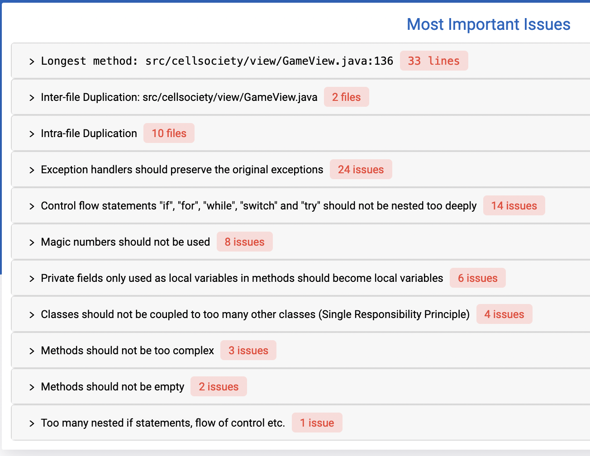

## Lab Discussion

### Team 17

### Names

Morgan Feist, Marcus Deans, Drew Peterson

### Issues in Current Code

#### GameGrid

* Was using extensive magic values in the formatting for the JavaFX Display
    * Have refactored appropriately and moved many values into appropriate resource files

#### GameView

* Had overly large methods that contained substantial setup code within them -> moved to several
  different classes which are more manageable
    * Use inheritance hierarchy appropriately
    * Have several different resource files that clearly distinguish between them

#### LifeGrid

* Had overly complex method that are performing various game rule actions
    * Extracted two methods in order to fulfill single action paradigm for methods
* Removed magic values and moved into resource file
* Removed redundant code and used inheritance hierarchy better

### Refactoring Plan

* What are the code's biggest issues?
    * Some long methods with complicated logic
    * Exception method messages are chosen arbitrarily instead of from a properties file
    *
* Which issues are easy to fix and which are hard?
    * Fixing global/local and public/private variables is easy
    *
* What is your plan to implement the changes without losing control of the process?
    * We have documented appropriately the key areas that we intend to refactor
    * We will work on the aspects of refactoring that correspond to the portions of the project that
      we worked on, as that person has the best understanding of the file structure and how it can
      be modified appropriately
    * We will continue to maintain collaboration and commmunication about what we are working on
      which will help to avoid any conflicts

### Refactoring Work

* Issue chosen: Fix and Alternatives
    *

* Issue chosen: Fix and Alternatives